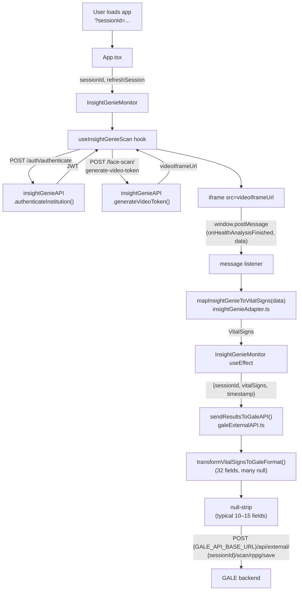

# QHealth — Binah → Insight-Genie Migration

Reference documentation for the migration of the QHealth web-based scanning app from a local **Biosense Signal SDK (Binah)** integration to a cloud-based **Insight-Genie iframe** integration.

The two implementations live as two branches of this same repo:

| Branch | Role |
|---|---|
| `binah` | Old implementation (Biosense Signal SDK) |
| `local` (descended from `insight_genie`) | New implementation (Insight-Genie) |

All file:line citations below refer to the `local` branch unless prefixed with `binah:`.

---

## 1. Overview

QHealth previously embedded the proprietary `@biosensesignal/web-sdk` library in the browser. The SDK requested camera access, ran rPPG (remote photoplethysmography) directly on-device, and emitted ~30 vital-sign fields via in-process callbacks. The app then forwarded those results to the QHealth GALE backend over REST.

The migration replaces the on-device SDK with a hosted Insight-Genie face-scan: the app authenticates against Insight-Genie, requests a one-time `videoIframeUrl`, and embeds that URL in an iframe. The iframe owns the camera and runs the analysis remotely; results arrive in the parent page via `postMessage`. The parent then maps Insight-Genie's response into the existing `VitalSigns` shape and forwards it to the **same** GALE endpoint as before — just with a smaller payload (Insight-Genie returns fewer fields than Binah, and the GALE caller now strips `null` keys before posting).

The GALE endpoint, headers, and `scan_source_id`/`scan_source_system_name`/`scan_source_publisher`/`scan_result` envelope shape are unchanged, which keeps the QHealth backend a no-op for this migration.

---

## 2. Side-by-Side Architecture Comparison

| Aspect | OLD — Binah | NEW — Insight-Genie |
|---|---|---|
| Scan engine | Browser SDK (`@biosensesignal/web-sdk`) running locally | Hosted iframe served by Insight-Genie |
| Auth model | Client-side license key (`LICENSE_KEY` env / localStorage) | Server-side institution credentials → JWT (`INSIGHT_GENIE_API_KEY` + `_API_SECRET`) |
| Camera control | App enumerates devices and selects (`useCameras`) | Iframe owns camera; app does not select |
| Video element | `<video>` ref passed to SDK | `<iframe src={videoIframeUrl}>` |
| Result delivery | Synchronous SDK callbacks: `onVitalSign`, `onFinalResults` | Asynchronous `window.postMessage` events from iframe |
| Error system | 150+ alert codes mapped via `alertUtils` + `alerts.json` | Plain `{ message: string }` |
| Demographics input | URL query params (`?sex=…&age=…&height=…&weight=…&smoking=…`) parsed by `useDemographics` | Optional `age`, `gender` only, passed via hook options |
| Measurement duration | Configurable client-side (20–180s, `useMeasurementDuration`) | Controlled by Insight-Genie service |
| Results UI | `ResultsModal` | `InsightGenieResults` (categorized grid) |
| Device gating | `DesktopFallback` shown on desktop/tablet | None; iframe runs on whatever device |
| Vital-sign field count | 32 fields exposed by `useMonitor` | 21 of those 32 populated by adapter; ~10–15 typically reach GALE after null-strip |

---

## 3. Removed / Added / Modified Files

### Removed (9 source files)

Verified via `git diff --name-only --diff-filter=D binah..local -- src`:

| File | Purpose | Replacement |
|---|---|---|
| `src/components/BiosenseSignalMonitor.tsx` | SDK measurement UI + state machine | `src/components/InsightGenieMonitor.tsx` |
| `src/hooks/useMonitor.ts` | SDK session lifecycle & vital-sign aggregation | `src/hooks/useInsightGenieScan.ts` |
| `src/hooks/useDemographics.ts` | Parse URL params for `sex`, `age`, `height`, `weight`, `smoking` | None — `useInsightGenieScan` accepts `age`, `gender` only |
| `src/hooks/useError.ts` | Map SDK alert codes → human-readable error string | None — Insight-Genie errors are already strings |
| `src/hooks/useWarning.ts` | Map SDK alert codes → human-readable warning, auto-dismiss | None |
| `src/hooks/useLicenseDetails.ts` | License key + measurement duration + product ID state | None — auth is server-side |
| `src/hooks/useCameras.ts` | Enumerate cameras, request permission, iOS Safari guidance | None — iframe handles camera |
| `src/lib/alertUtils.ts` | `getAlertDescription(code)` / `getAlertInfo(code)` lookups | None |
| `src/data/alerts.json` | 150+ SDK error codes with `cause` + `solution` text | None |

### Added (6 files)

| File | Purpose |
|---|---|
| `src/components/InsightGenieMonitor.tsx` | Iframe container, scan-state UI, dispatch to GALE on completion |
| `src/components/InsightGenieResults.tsx` | Categorized results grid (Cardiovascular / Heart / HRV / Blood / Other) |
| `src/hooks/useInsightGenieScan.ts` | Auth → token → iframe URL → `postMessage` listener → adapter |
| `src/services/insightGenieAPI.ts` | REST client for `/auth/authenticate` and `/face-scan/generate-video-token` |
| `src/services/insightGenieAdapter.ts` | Deep-key extractor + map Insight-Genie response → `VitalSigns` + `HealthResult[]` |
| `src/types/insightGenie.ts` | `FaceScanRequest`, `FaceScanResponse`, `ScanState`, `HealthResult`, action enums |

### Modified

| File | Substantive change |
|---|---|
| `src/components/App.tsx` | ~175 → ~52 lines. Removed all camera plumbing, license-status callback, desktop-fallback gate, retry/timeout state |
| `src/components/TopBar.tsx` | Removed `useTimer` countdown and refresh button; right slot now empty |
| `src/hooks/useDeviceDetection.ts` | Dropped `import { isMobile, isTablet } from "@biosensesignal/web-sdk"`; now UAParser + OS-name + screen-width only |
| `src/hooks/index.ts` | Removed exports: `useError`, `useCameras`, `useLicenseKey`, `useProductId`, `useMeasurementDuration`, `useMonitor`, `useWarning`. Kept: `useDisableZoom`, `usePageVisibility`, `usePrevious`, `useTimer` |
| `src/services/galeExternalAPI.ts` | Same endpoint and 32-slot transformer, but now strips `null`/`undefined` keys before POST and short-circuits if `scan_result` is empty (lines 401–416) |

---

## 4. API Comparison

### OLD — Biosense Signal SDK (in-process callbacks)

The SDK was instantiated in `binah:src/hooks/useMonitor.ts`:

```ts
import monitor from "@biosensesignal/web-sdk"

const session = await monitor.startSession({
  videoElement: video.current,
  licenseKey,
  demographics: { age, height, weight, sex, smoking },
})

session.onVitalSign(vs => { /* live updates */ })
session.onFinalResults(r => { /* ~30 fields */ })
session.onError(e => { /* alert code */ })
session.onWarning(w => { /* alert code */ })
session.onStateChange(s => { /* lifecycle */ })
```

There were **no HTTP calls** to a Binah backend — everything ran in-process under a license key.

### NEW — Insight-Genie (REST + iframe `postMessage`)

#### 4.1 Authenticate institution

`src/services/insightGenieAPI.ts:34-71`

```
POST  {INSIGHT_GENIE_BASE_URL}/auth/authenticate
Headers: Content-Type: application/json
Body:    { key: INSIGHT_GENIE_API_KEY, secret: INSIGHT_GENIE_API_SECRET }
Response: { token: string }   // JWT, cached in module-level promise
```

#### 4.2 Generate video iframe URL

`src/services/insightGenieAPI.ts:73-100`

```
POST  {INSIGHT_GENIE_BASE_URL}/face-scan/generate-video-token
Headers: Content-Type: application/json
         Authorization: Bearer <jwt-from-step-4.1>
Body:    FaceScanRequest          // see src/types/insightGenie.ts
Response: { success: boolean, videoIframeUrl: string }
```

`FaceScanRequest` defaults provided by `createDefaultRequest()` (`src/services/insightGenieAPI.ts:102-124`):

```ts
{
  clientId,
  showResults: "display",
  noDesign: false,
  faceOutline: true,
  buttonBgColor: "#2d5016",       // QHealth green
  buttonTextColor: "#ffffff",
  isVoiceAnalysisOn: false,
  forceFrontCamera: true,
  language: "en",
  showDisclaimer: true,
  // optional: age, gender, diabetesHypertensionParameters{...}
}
```

#### 4.3 Iframe → parent `postMessage` actions

Consumed in `src/hooks/useInsightGenieScan.ts:135-200`:

| `action` | Carried data | Effect in app |
|---|---|---|
| `onAnalysisStart` | — | `scanState` → `"analyzing"` |
| `conditionStatus` | `{ centered, lighting, movement }` | Real-time positioning feedback |
| `scanTimeRemaining` | `seconds: number` | Countdown display |
| `onHealthAnalysisFinished` | Full Insight-Genie metrics blob | Fed into `mapInsightGenieToVitalSigns()` and `extractInsightGenieResults()`; `scanState` → `"complete"` |
| `failedToGetResults` / `failedToGetHealthAnalysisResult` / `failedToGetVoiceAnalysisResult` / `failedToLoadPage` | error info | `scanState` → `"error"` |

---

## 5. GALE Endpoint (unchanged URL, new behaviour)

`src/services/galeExternalAPI.ts:418-457`

```
POST  {GALE_API_BASE_URL}/api/external/{sessionId}/scan/rppg/save
Headers: Content-Type: application/json
         x-api-key:    {GALE_API_KEY}
Body: {
  scan_source_id:           sessionId,
  scan_source_system_name:  GALE_SCAN_SOURCE_SYSTEM_NAME,   // "QHealth System"
  scan_source_publisher:    GALE_SCAN_SOURCE_PUBLISHER,     // "QHealth"
  scan_result:              { ...only non-null fields... }
}
```

The **endpoint, method, headers, and envelope are unchanged from Binah**. The only difference is the body of `scan_result`:

- **OLD**: All 32 transformed fields shipped, including `null` slots.
- **NEW** (added at `src/services/galeExternalAPI.ts:401-416`):

  ```ts
  const scanResultWithNulls = transformVitalSignsToGaleFormat(results.vitalSigns)
  const scanResult: Record<string, any> = {}
  Object.entries(scanResultWithNulls).forEach(([key, value]) => {
    if (value !== null && value !== undefined) scanResult[key] = value
  })
  if (Object.keys(scanResult).length === 0) {
    return { success: false, error: "No vital signs data available to send" }
  }
  ```

---

## 6. Data Mapping (32 → ~10)

The Binah `useMonitor` hook produced **32 vital-sign fields**. The Insight-Genie adapter populates **21 of them**; the other **11 are dropped**. After the runtime null-strip in `galeExternalAPI.ts`, a typical real-world request to GALE carries roughly **10–15 fields** depending on what Insight-Genie returned for that particular scan.

### Full field-by-field table

`useMonitor` field names taken from `binah:src/hooks/useMonitor.ts:186-231`. Adapter mappings from `src/services/insightGenieAdapter.ts:398-457`. GALE wire names from `src/services/galeExternalAPI.ts:85-122`.

| # | Binah `VitalSigns` field | Insight-Genie source key | GALE wire name (`scan_result.*`) | Status |
|---|---|---|---|---|
| 1 | `pulseRate` | `heartRate` | `heart_rate` | Retained |
| 2 | `respirationRate` | `respiratoryRate` | `respiration_rate` | Retained |
| 3 | `oxygenSaturation` | `spo2` | `oxygen_saturation` | Retained |
| 4 | `bloodPressure` | `systolic`/`diastolic` | `blood_pressure` (`"sys/dia"`) | Retained |
| 5 | `sdnn` | `sdnn` | `sdnn` | Retained |
| 6 | `rmssd` | `rmssd` | `rmssd` | Retained |
| 7 | `sd1` | — | `sd1` | **Dropped** |
| 8 | `sd2` | — | `sd2` | **Dropped** |
| 9 | `meanRri` | `meanRri` | `mean_rri` | Retained |
| 10 | `rri` | — | (n/a — array) | **Dropped** |
| 11 | `lfhf` | `lfhf` | `lf_hf_ratio` | Retained |
| 12 | `stressLevel` | `stress` | `stress_level` | Retained |
| 13 | `stressIndex` | `stress` | `stress_index` | Retained |
| 14 | `normalizedStressIndex` | — | `normalized_stress_index` | **Dropped** |
| 15 | `wellnessIndex` | `wellness` | `wellness_index` (+ derived `wellness_level`) | Retained |
| 16 | `snsIndex` | — | `sns_index` | **Dropped** |
| 17 | `snsZone` | — | `sns_zone` | **Dropped** |
| 18 | `pnsIndex` | — | `pns_index` | **Dropped** |
| 19 | `pnsZone` | — | `pns_zone` | **Dropped** |
| 20 | `prq` | — | `prq` | **Dropped** |
| 21 | `heartAge` | `heartAge` | `heart_age` | Retained |
| 22 | `hemoglobin` | `hemoglobin` | `hemoglobin` | Retained |
| 23 | `hemoglobinA1c` | `hemoglobinA1c` | `hemoglobin_a1c` | Retained |
| 24 | `cardiacWorkload` | `cardiacWorkload` | `cardiac_workload` | Retained |
| 25 | `meanArterialPressure` | computed `(sys + 2·dia)/3` | `mean_arterial_pressure` | Retained (computed) |
| 26 | `pulsePressure` | computed `sys − dia` | `pulse_pressure` | Retained (computed) |
| 27 | `ascvdRisk` | `ascvd` | `ascvd_risk` (`"low"`/`"medium"`/`"high"`) | Retained |
| 28 | `highBloodPressureRisk` | `hypertensionRisk` (fallback CHF/CHD/stroke) | `high_blood_pressure_risk` | Retained |
| 29 | `highFastingGlucoseRisk` | `diabetesRisk` | `high_fasting_glucose_risk` | Retained |
| 30 | `highHemoglobinA1CRisk` | `diabetesRisk` | `high_hemoglobin_a1c_risk` | Retained (rarely populated) |
| 31 | `highTotalCholesterolRisk` | — | `high_total_cholesterol_risk` | **Dropped** |
| 32 | `lowHemoglobinRisk` | — | `low_hemoglobin_risk` | **Dropped** |

**Totals:** 21 retained · 11 dropped.

### The 11 dropped fields

`sd1`, `sd2`, `rri`, `normalizedStressIndex`, `snsIndex`, `snsZone`, `pnsIndex`, `pnsZone`, `prq`, `highTotalCholesterolRisk`, `lowHemoglobinRisk`.

These are predominantly granular HRV/ANS metrics (Poincaré `sd1`/`sd2`, full `rri` series, sympathetic/parasympathetic zones) plus two risk indicators that Insight-Genie does not surface. The QHealth UI's `Stats` component already had several of these commented out (see commits `30082c7`, `8226084`, `eea858e`).

### The "typical 10" actually reaching GALE

After null-strip, a typical Insight-Genie scan posts roughly these 10 fields:

`heart_rate`, `respiration_rate`, `blood_pressure`, `mean_arterial_pressure`, `pulse_pressure`, `stress_index`, `stress_level`, `wellness_index`, `sdnn`, `rmssd`.

Other retained fields (`oxygen_saturation`, `heart_age`, `hemoglobin`, risk levels, etc.) appear when Insight-Genie includes them in that scan's response.

---

## 7. Data Flow



### Step trace with file:line

1. App boots, reads `sessionId` from URL → `src/components/App.tsx:42-58`.
2. `<InsightGenieMonitor sessionId={…}>` is rendered.
3. `useInsightGenieScan({ autoStart: true, sessionId, age?, gender? })` is invoked → `src/hooks/useInsightGenieScan.ts:76-133`.
4. Hook calls `authenticateInstitution()` → `src/services/insightGenieAPI.ts:34-71`. Token is cached in a module-level promise.
5. Hook calls `generateVideoToken(createDefaultRequest(sessionId, age, gender))` → `src/services/insightGenieAPI.ts:73-100, 102-124`. Returns `videoIframeUrl`.
6. Hook stores `iframeUrl` and transitions `scanState` to `"positioning"`. The `<iframe>` is rendered with `src={iframeUrl}`.
7. `window.addEventListener("message", …)` (`src/hooks/useInsightGenieScan.ts:135-200`) routes `postMessage` actions:
   - `onAnalysisStart` → `"analyzing"`
   - `conditionStatus` → `setConditionStatus(...)`
   - `scanTimeRemaining` → `setScanTimeRemaining(...)`
   - `onHealthAnalysisFinished` → call adapter, set `vitalSigns`, transition to `"complete"`
   - failure actions → `"error"`
8. Adapter normalizes the deeply nested response (`extractDeepMetrics` in `src/services/insightGenieAdapter.ts:183-396`) and maps it to `VitalSigns` (`mapInsightGenieToVitalSigns` at `:398-457`).
9. `InsightGenieMonitor`'s effect (`src/components/InsightGenieMonitor.tsx:68-84`) sees `scanState === "complete" && vitalSigns && sessionId`, sets a one-shot ref guard, builds `{ sessionId, vitalSigns, timestamp: Date.now() }`, and calls `sendResultsToGaleAPI(...)`.
10. `sendResultsToGaleAPI` (`src/services/galeExternalAPI.ts:379-517`):
    - `transformVitalSignsToGaleFormat()` (lines 65–377) builds the 32-slot `scan_result` object.
    - Lines 401–411 strip `null`/`undefined` keys.
    - Lines 414–416 short-circuit if `scan_result` is empty.
    - Lines 418–424 wrap in the GALE envelope.
    - Lines 450–457 `fetch` with `POST`, `Content-Type`, and `x-api-key`.
11. Errors are logged but **swallowed** (`return { success: false, error }`) so a failed save does not block the user. (Detailed error logging restored in commit `a600749`.)

---

## 8. Environment Variable Changes

`.env_example` diff between `binah` and `local` (verified via `git show binah:.env_example`):

| Variable | Binah | Insight-Genie | Notes |
|---|---|---|---|
| `LICENSE_KEY` | required | removed | SDK license; no longer needed |
| `INSIGHT_GENIE_BASE_URL` | — | added | e.g. `https://api.insightgenie.ai` |
| `INSIGHT_GENIE_API_KEY` | — | added | Institution credential |
| `INSIGHT_GENIE_API_SECRET` | — | added | Institution secret |
| `GALE_API_BASE_URL` | yes | yes | unchanged |
| `GALE_API_KEY` | yes | yes | unchanged (sent as `x-api-key` header) |
| `GALE_SCAN_SOURCE_SYSTEM_NAME` | yes | yes | default `"QHealth System"` |
| `GALE_SCAN_SOURCE_PUBLISHER` | yes | yes | default `"QHealth"` |
| `GALE_API_ENABLED` | yes | yes | unchanged |
| `WEBPACK_DEV_SERVER_PORT` | — | added (dev) | default `8001` |
| `WEBPACK_DEV_SERVER_HOST` | — | added (dev) | default `localhost` |
| `WEBPACK_DEV_SERVER_HTTPS` | — | added (dev) | default `true` |
| `WEBPACK_DEV_SERVER_USE_LOCAL_IP` | — | added (dev) | default `false` |
| `WEBPACK_DEV_SERVER_DISABLE_HOST_CHECK` | — | added (dev) | default `true` |
| `WEBPACK_DEV_SERVER_PUBLIC_URL` | — | added (dev) | Set when reaching the dev server through a public/tunneled domain so the HMR WebSocket connects through the correct origin (e.g. `wss://qhealth-webbased.quanbyit.com/ws`) |

---

## 9. Feature Changes

### Removed

- **Alert/error code system.** 150+ Biosense codes mapped to `cause`/`solution` text via `alerts.json` + `alertUtils.ts` + `useError`/`useWarning`. Insight-Genie provides plain error strings only.
- **Camera enumeration & permission UI.** `useCameras` listed devices, requested permission with iOS Safari guidance, and surfaced retry state. Now the iframe handles all of this internally.
- **URL-param demographics.** `useDemographics` parsed `?sex=…&age=…&height=…&weight=…&smoking=…`. New hook only takes optional `age` and `gender` (no height/weight/smoking).
- **Client license-key management.** `useLicenseKey` + `useProductId` + `useMeasurementDuration` (20–180s configurable). Auth is now server-side and duration is controlled by Insight-Genie.
- **In-app countdown timer in `TopBar`.** `useTimer` + refresh button removed; right slot is empty.
- **`DesktopFallback` gating in `App`.** App no longer detects desktop and shows a fallback screen — the iframe runs anywhere.
- **`ResultsModal`.** Replaced by the categorized `InsightGenieResults` grid.

### Added

- **Iframe scan state machine** (`src/hooks/useInsightGenieScan.ts`): `idle → authenticating → positioning → analyzing → complete | error`.
- **Real-time `conditionStatus` feedback** during positioning (`centered`, `lighting`, `movement`).
- **Categorized results grid** (`InsightGenieResults`): Cardiovascular, Heart, HRV, Blood, Other — with Good/Average/Poor status badges and normal-range hints.
- **Server-side institution auth** with module-level token caching in `insightGenieAPI.ts`.
- **Deep-key extraction** in `insightGenieAdapter.ts:183-396` (`extractDeepMetrics`) — tolerant of arbitrary nesting and synonym keys (`heart_rate` / `heartRate` / `bpm` / `hr` / `pulse_rate`).
- **Risk-percent → label** helper (`riskLevelFromPercent`): `<2%` → `Low`, `<5%` → `Medium`, else `High`.
- **GALE payload null-strip** (see §5).
- **Dev-server public-URL config** (`WEBPACK_DEV_SERVER_PUBLIC_URL`) to fix HMR/WebSocket CORS when serving the dev server through a tunneled domain.

---

## 10. Code-Level Differences (focused)

### `src/components/App.tsx`

- ~175 lines (binah) → ~52 lines (local).
- **Removed**: `useCameras`; `cameras`/`cameraId`/`isLicenseValid`/`hasTimedOut`/`isRetryingPermission` state; `handleRetryCameraPermission()`; camera loading spinner & error UI; `DesktopFallback` gate; license-status callback.
- **Result**: only `useDeviceDetection`, `useSession`, `useDisableZoom` remain. Renders `<TopBar/>` + `<InsightGenieMonitor sessionId={session?.sessionId} onRefreshSession={refreshSession} />`.

### `src/components/TopBar.tsx`

- Removed `import { useTimer } from "../hooks"` and `import Refresh from "../assets/refresh.svg"`.
- Removed countdown computation and the conditional refresh-button block.
- Now accepts `remainingSeconds?: number | null` but does not render it; right slot is `<div className="flex items-center justify-end" />`.

### `src/hooks/useDeviceDetection.ts`

- Dropped `import { isMobile, isTablet } from "@biosensesignal/web-sdk"` and the `sdkMobile`/`sdkTablet` priority chain.
- Detection is now `UAParser.getDevice()` + `UAParser.getOS().name` against the mobile-OS allowlist (`Android`, `iOS`, `iPadOS`, `Windows Phone`) + screen width.
- Resize handler refactored to a single `setDeviceDetection(detect())` call.

### `src/hooks/index.ts`

- **Removed exports** (7): `useError`, `useCameras`, `useLicenseKey`, `useProductId`, `useMeasurementDuration`, `useMonitor`, `useWarning`.
- **Kept exports** (4): `useDisableZoom`, `usePageVisibility`, `usePrevious`, `useTimer`.

### `src/services/galeExternalAPI.ts`

- Endpoint, method, headers, and 32-slot `transformVitalSignsToGaleFormat` are **unchanged in shape**.
- Added (lines 401–416): null-strip pass and "no vital signs" short-circuit.
- Several `console.log` lines around the request are commented out (cleanup commits `816b0df`, `9b800b5`, `2eb0017`); the catch block's detailed `console.error` was restored in `a600749`.

---

## 11. Migration Checklist

For anyone replaying this migration on another fork:

- [ ] Remove `@biosensesignal/web-sdk` from `package.json` (and any leftover license/key paths).
- [ ] Delete the 9 source files listed in §3 (Removed).
- [ ] Add the 6 new files listed in §3 (Added).
- [ ] Replace `BiosenseSignalMonitor` mounts with `InsightGenieMonitor`; drop `cameraId` and `onLicenseStatus` props.
- [ ] Replace `useMonitor(...)` callers with `useInsightGenieScan({ autoStart, sessionId, age?, gender? })` and migrate to its new return shape (`iframeUrl`, `scanState`, `vitalSigns`, `displayResults`, `error`, `conditionStatus`, `scanTimeRemaining`, `iframeRef`, `resetScan`).
- [ ] Update `hooks/index.ts` re-exports to match §10.
- [ ] Strip the SDK import from `useDeviceDetection.ts`.
- [ ] Verify the GALE caller still compiles after `transformVitalSignsToGaleFormat` is followed by the null-strip block (lines 401–416).
- [ ] Replace `LICENSE_KEY` in `.env` with `INSIGHT_GENIE_BASE_URL`, `INSIGHT_GENIE_API_KEY`, `INSIGHT_GENIE_API_SECRET`.
- [ ] Confirm the GALE endpoint accepts the smaller `scan_result` payload (it should — same envelope, fewer keys).
- [ ] Smoke test: open the app with `?sessionId=…&age=24&sex=male`, complete a scan, confirm the network panel shows one `POST /api/external/{sessionId}/scan/rppg/save` with the expected ~10 fields.

---

## 12. Impact Summary

The migration trades a self-contained, license-gated on-device SDK for a hosted SaaS dependency. The browser app shrinks substantially (no camera selection, no alert codes, no license/duration UI, no desktop-fallback gating, no demographic intake), and the GALE payload is leaner (~10 fields vs ~32). In exchange, scan correctness now depends on Insight-Genie's availability and accuracy, and granular HRV/ANS metrics (`sd1`/`sd2`/full `rri`/SNS/PNS zones) and two risk indicators (`highTotalCholesterolRisk`, `lowHemoglobinRisk`) are no longer captured. The QHealth GALE backend was unaffected — the envelope is identical, the field set is a strict subset of the previous one.
